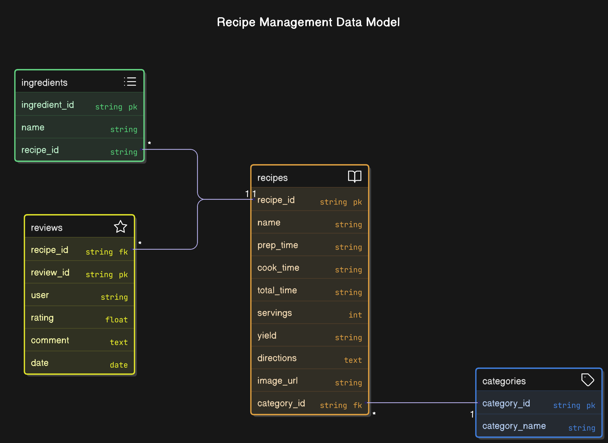

# NoSQL_Project: 🍽️ Rezeptverwaltung mit MongoDB & Flask

Ein NoSQL_Project zur Verwaltung von Rezepten – komplett mit Zutaten, Kategorien, Bewertungen und Bildern (per URL)! Erstellt mit **Flask**, **MongoDB** in Python 🐍.

---

## 📦 Features

✅ Vorverarbeitung der Rohdaten aus CSV-Dateien  
✅ Datenbank: MongoDB – ideal für flexible NoSQL-Datenstrukturen  
✅ Übersicht aller Rezepte in einer Web-Oberfläche  
✅ Rezepte hinzufügen (inkl. Bild-URL)  
✅ Bewertungen / Reviews schreiben (Dummy-Kommentare aus csv sind vorhanden)  
✅ Rezepte und Bewertungen / Reviews können bearbeitet und gelöscht werden  

---

| Komponente         | Beschreibung                                                                 |
|--------------------|------------------------------------------------------------------------------|
| 🐍 **Python**       | Hauptsprache für Backend und Datenaufbereitung                              |
| 🌐 **Flask**        | Web-Framework für das Frontend & Routing                                     |
| 🍃 **MongoDB**      | NoSQL-Datenbank zur Speicherung der Rezepte und Metadaten                   |
| 🐳 **Docker**       | MongoDB läuft in einem Docker-Container  |
| 📄 **CSV-Import**   | Ursprungsdaten werden via `split_csv.py` in 4 separate CSV-Dateien zerlegt  |


## 🗂️ Datenmodell

Die Daten sind in vier Kollektionen strukturiert:

- `recipes`: Enthält Basisdaten wie Name, Zeitangaben, Bild, Beschreibung etc.
- `ingredients`: Alle Zutaten mit Rezept-Zuordnung
- `categories`: Kategoriebezeichnungen (z. B. Dessert, Vegan)
- `reviews`: Dummy-Bewertungen zu jedem Rezept
<br>



## 🧪 Setup

1. **MongoDB und Docker starten**

- build docker

    ```bash
    docker-compose up --build -d

2. MongoDB starten auf port 27017
3. Originaldaten können mit `split_csv.py` aufbereitet werden (falls nicht vorhanden im Ordner /data)
4. Daten in DB laden mit `init_script.py`
5. App aufrufen: http://localhost:5000
<br><br>

6. Docker stoppen und erneut starten
- stoppen

   ```bash
   docker-compose down

- erneut starten

   ```bash
   docker-compose up -d

## ✨ Beispielansicht

Ein typisches Rezept enthält:

    Titel, Zeiten, Portionen

    Bild (über Bild-URL angezeigt)

    Zutatenliste

    Bewertung

    Zubereitungsschritte


## ⚠️ Hinweis

Beim Aufbereiten der Originaldaten stellte sich eine zentrale Herausforderung: Die Trennung von Mengenangaben und Zutatenbezeichnungen war in vielen Fällen nicht eindeutig möglich. Beispielhaft seien hier Einträge wie:

    3 Apples

    3 Tablespoons Butter

genannt. Dabei ist nicht immer klar, ob etwa „Tablespoons“ zur Mengeneinheit oder bereits zur Zutat gehört – insbesondere, wenn komplexere oder mehrteilige Angaben gemacht werden. Eine automatisierte Trennung ohne fehleranfällige Heuristiken war daher kaum möglich.

Entscheidung:
Aus diesem Grund wurde entschieden, die vollständige Angabe – also Menge und Zutat – als einen gemeinsamen String in das Feld ingredients.name zu übernehmen.

Folgen dieser Lösung:

    Zutaten werden in der Datenbank nicht normalisiert, sondern pro Rezept separat gespeichert.

    Dadurch kann es zu Duplikaten oder Mehrfacheinträgen derselben (ähnlichen) Zutat kommen.

    Auf eine dedizierte Zwischentabelle zur Verknüpfung von Zutaten und Rezepten wurde bewusst verzichtet, da sie in diesem Fall keinen Mehrwert bieten würde.

Diese pragmatische Lösung ermöglicht eine einfache und funktionale Nutzung der Daten für das Projekt, ohne sich in der Datenvorverarbeitung zu verlieren.
